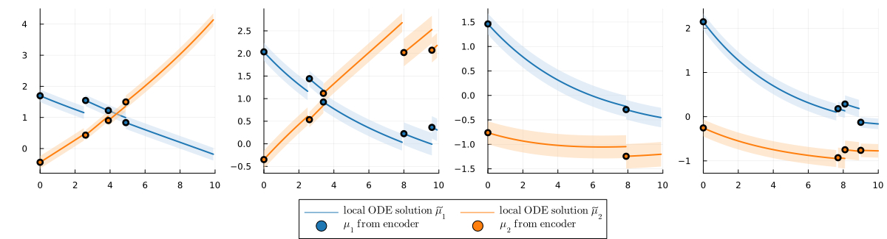

# LatentDynamics.jl 



## Overview

This is a Julia package for fitting dynamic models based on ODEs in the latent space of a VAE. Specifically, it implements an approach where each observation serves as the initial value to obtain multiple local ODE solutions which are used to build an inverse-variance weighted estimator of the underlying dynamics. This reduces dependence of the ODE solution on the initial condition and can provide more robust estimation of the underlying trajectory particularly in settings with a high level of noicse. To deal with a larger number of variables, the approach is combined with a VAE for dimension reduction, as the ODE systems are defined and solved in the latent space of a VAE model.
The model has been developed for the setting of a clinical registry, e.g., from a rare disease, where data might be noisy and heterogeneous and only few and irregular time points are available per patients. In this setting, we use the characterization of patients at the baseline time point to learn individual trajectories, by mapping each patient's baseline variables with an additional neural network to a set of individual-specific ODE parameters. We simultaneously optimize all components, the VAE for dimension reduction, the dynamic model and the network for mapping baseline variables to ODE parameters, using differentiable programming. This allows for finding a low-dimensional representation that is specifically adapted to the underlying trajectories as described by the person-specific ODE systems. 

The package includes functions for defining and training the VAE with and ODE-based dynamic in latent space, including a wide range of customizable hyperparameters and options for controlling the training behavior. There are also different choices for the underlying ODE system with different numbers of parameters. Further, the package provides functions for visualizing the learned latent trajectories and evaluating prediction performance at subsequent time points, both in latent space and on the reconstructed data and in comparison to simpler baseline models. In addition, the package provides functions for loading and pre-processing data from the SMArtCARE registry on spinal muscular atrophy (SMA) patients, which is used as an example application in the corresponding manuscript, and, as this data is not publicly available, for simulating data with a similar structure. 

For more details, please have a look at our manuscript [Hackenberg et al. (2023) A statistical approach to latent dynamic modeling with differential equations](arXiv_link).

## Get started 

The package can be installed from this GitHub repository via the following command: 

```{julia}
using Pkg;
Pkg.add(url="https://github.com/maren-ha/LatentDynamics.jl")
using LatentDynamics
```

## Demo example 

The following illustrates a simple example of how to use the package using simulated data. For more details, see the documentation of the individual functions accessible by typing `?` followed by the function name in the Julia REPL, and in the documentation page. 

First, we install and load the necessary packages: 

```{julia}
Pkg.add("Plots")
Pkg.add(PackageSpec(name="Zygote", version="0.6.59"))

using LatentDynamics
using Random
using Plots
```
Next, we simulate data from a simple two-dimensional linear homogeneous ODE system with four parameters. We define two distinct sets of parameters, corresponding to groups of indiduals with distinct underlying trajectories, and simulate individuals from each of the two groups by adding noise to the true trajectories. 

First, we define the system and the solutions for each of the two groups:

```{julia}
dynamics = params_fullhomogeneous

trueparams_group1 = [-0.2f0, 0.1f0, -0.1f0, 0.1f0]
trueparams_group2 = [-0.2f0, -0.1f0, 0.1f0, -0.2f0]
true_x0 = Float32[3, 1]

ODEparams1 = dynamics(trueparams_group1)
ODEparams2 = dynamics(trueparams_group2)

tspan = (0.0f0, 10.0f0)
t_range = collect(range(tspan..., step=0.1f0))

sol_group1 = hcat(map(t -> LatentDynamics.generalsolution(t, true_x0, ODEparams1...)[1], t_range)...)
sol_group2 = hcat(map(t -> LatentDynamics.generalsolution(t, true_x0, ODEparams2...)[1], t_range)...)
```

Next, we simulate data and visualize it together with the ground-truth solutions

```{julia}
n = 100 
p = 10
q, q_info = 50, 10
dt=0.1f0

# set seed for reproducibility
Random.seed!(12);

# generate time dependent variables
xs, tvals, group1, group2 = generate_xs(n, p, true_x0, sol_group1, sol_group2, maxntps=8); 
# generate baseline variables
xs_baseline = generate_baseline(n, q, q_info, group1, trueparams_group1, trueparams_group2); 

data = simdata(xs, xs_baseline, tvals, group1, group2);

# plot true solutions and simulated data
plot(plot_truesolution(2, data, t_range, sol_group1, sol_group2, showdata=false), 
    plot_truesolution(1,  data, t_range, sol_group1, sol_group2, showdata=false), 
    plot_truesolution(2, data, t_range, sol_group1, sol_group2, showdata=true), 
    plot_truesolution(1,  data, t_range, sol_group1, sol_group2, showdata=true),
    layout = (2,2),
    legend = false
)
```
Next, we initialize the model 

```{julia}
n = length(xs)

# init model 
modelargs = ModelArgs(p=size(xs[1],1), 
                    q=length(xs_baseline[1]),
                    dynamics=dynamics,
                    seed=18,
                    bottleneck=false,
                    scale_sigmoid=1,
                    add_diagonal=true
)
m = odevae(modelargs)
```
We define the loss function behavior and the optimization hyperparameters and train the model.

```{julia}
args = LossArgs(skipt0=true, weighting=true, 
                λ_variancepenalty=0.0f0,
                λ_μpenalty=0.5f0
)

lr = 0.0005
epochs = 30

Random.seed!(42)
selected_ids = rand(collect(1:length(xs)), 6)

train_model!(m, xs, xs_baseline, tvals, 
    lr, epochs, args; 
    selected_ids=selected_ids, 
    verbose=true, plotting=false
)
```

We can now plot the learnt trajectories of a few randomly selected individuals from each group. 

```{julia}
sel_inds1, sel_inds2 = shuffle(group1)[1:6], shuffle(group2)[1:6]
selected_inds = vec([sel_inds1[1:2]... sel_inds2[1:2]... sel_inds1[3:4]... sel_inds2[3:4]... sel_inds1[5:6]... sel_inds2[5:6]...])

plot_selected_ids_piecewise(m, data, selected_inds, sol_group1, sol_group2, t_range; 
    showOLS=false, swapcolorcoding=true, sort_inds=false, showtitle = false, showtruesol = false
)
```
