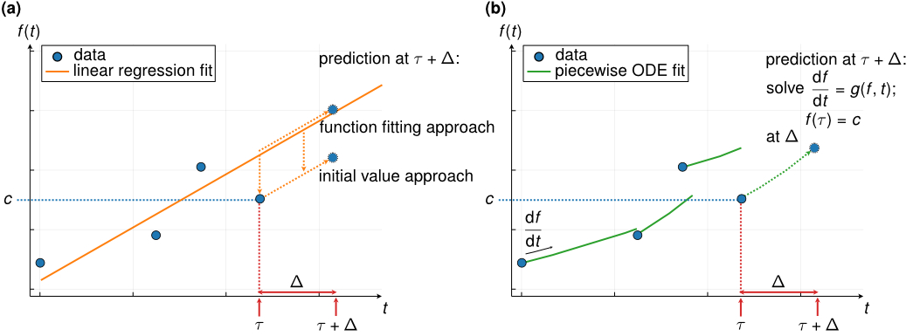

# LatentDynamics.jl 

[](https://maren-ha.github.io/LatentDynamics.jl/dev/)



## Overview

This is a Julia package for fitting dynamic models based on ODEs in the latent space of a VAE. Specifically, it implements a statistical approach based on ODEs, where each observation serves as the initial value to obtain multiple local ODE solutions. The solutions are combined into an inverse-variance weighted estimator of the underlying dynamics. This reduces dependence of the ODE solution on the initial condition and provide a more robust estimation of the underlying trajectory, particularly in settings with a high level of noicse. 
The ODEs are solved in the latent space of a VAE model, to reflect the assumption of an underlying latent process driving the observed measurements, for which the dynamics shall be modeled. 

This illustrates how this enables the use of ODEs in longitudinal clinical registries, specifically focusing on the scenario of a rare disease registry on patients with spinal muscular atrophy (SMA), where data is noisy and heterogeneous and only few and irregular time points are available per patients. 

We use the characterization of patients at the baseline time point to infer individual-specific ODE parameters for personalized dynamics using an additional neural network. All model components are optimized simultaneously based on differentiable programming, such that a low-dimensional representation can be found that is specifically adapted to the underlying trajectories as described by the person-specific ODE systems.

The package includes functions for defining and training the VAE with and ODE-based dynamic in latent space, including a wide range of customizable hyperparameters and options for controlling the training behavior. Different choices for the underlying ODE system with different numbers of parameters are available. Further, the package provides functions for visualizing the learned latent trajectories and evaluating prediction performance at subsequent time points, both in latent space and on the reconstructed data and in comparison to simpler baseline models. The package provides functions for loading and pre-processing data from the SMArtCARE registry on spinal muscular atrophy (SMA) patients, which is used as an example application in the corresponding manuscript. As this data is not publicly available, we additionally provide functions for simulating data with a similar structure. 

For details, please have a look at our preprint [Hackenberg et al. (2023) A statistical approach to latent dynamic modeling with differential equations](arXiv_link).

## What's in this repository 

- `src`: source code of the package
- `docs`: documentation of the package
- `figures`: figure used for the README
- `notebooks`: Jupyter notebooks that illustrate usage of the package and how the figures and results in the manuscript can be reproduced
- some housekeeping files: 
  - `Project.toml`: list of dependencies
  - `Manifest.toml`: list of dependencies with specific versions
  - `.gitignore`: files to be ignored by git
  - `LICENSE.md`: license information
- this `README.md` file 

## Getting started 

The package can be installed from this GitHub repository via the following command: 

```{julia}
using Pkg;
Pkg.add(url="https://github.com/maren-ha/LatentDynamics.jl")
using LatentDynamics
```

## Demo example 


An simple example of how to use the package on simulated data is provided in the `Simulation.ipynb` notebook in the `notebooks` subfolder. 

For more details om individual functions, see the documentation of the individual functions accessible by typing `?` followed by the function name in the Julia REPL, and in the [documentation pages](https://maren-ha.github.io/LatentDynamics.jl/dev/). 
